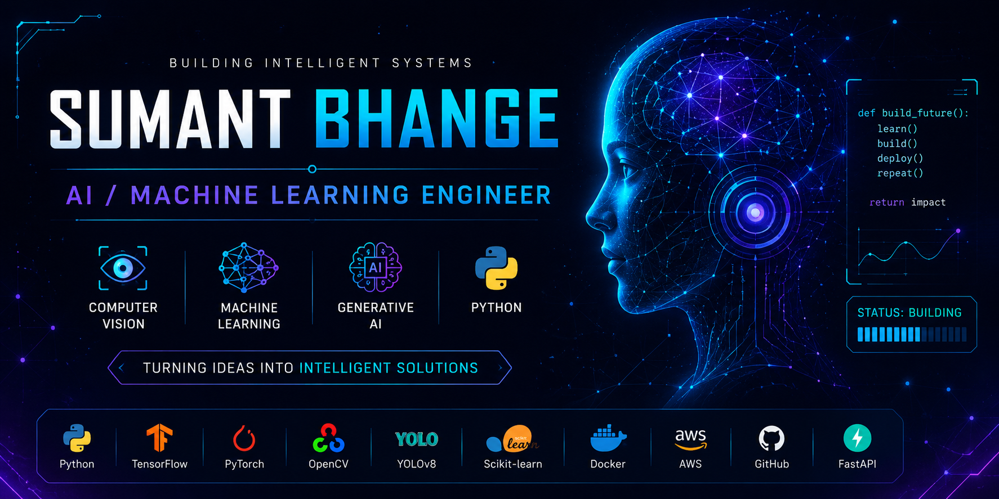

  

<h1 align="center">SUMANT BHANGE</h1>
<h3 align="center">Building Intelligent Systems with AI</h3>
<h4 align="center">AI / Machine Learning Engineer</h4>

## 👨‍💻 About Me

I'm **Sumant Bhange**, an AI professional passionate about building intelligent systems using Machine Learning, Computer Vision and Generative AI.

- 💼 AI Data Associate @ **iMerit (an EXL Company)**
- 🎓 B.Tech in Computer Science & Engineering (Artificial Intelligence)
- 🤖 Interested in Machine Learning, Computer Vision & LLMs
- 🌱 Currently learning FastAPI, RAG, MLOps & Production AI

## 🎯 Current Mission

- 🧠 Build production-ready AI systems
- 🤖 Learn LLM Engineering
- 👁️ Advance Computer Vision
- ⚡ Deploy AI with FastAPI
- 🚀 Contribute to Open Source

## ⚡ Tech Stack

**Also:** OpenCV • YOLOv8 • Scikit-learn • NumPy • Pandas • FastAPI • Power BI

<h2 align="center">🚀 Featured AI Projects</h2>

<table>

<tr>

<td width="50%">

<h3 align="center">🛡 GuardianShield</h3>

AI-powered Real-Time Fraud Detection Platform

</td>

<td width="50%">

<h3 align="center">🚗 Silo Parking</h3>

Vehicle Detection using YOLOv8

</td>

</tr>

</table>

## 📊 GitHub Analytics

<h2 align="center">🏆 GitHub Achievements</h2>

<h2 align="center">🐍 Contribution Graph</h2>

## 🏆 Certifications

## 🤝 Let's Connect

<h3 align="center">⭐ Thanks for visiting my GitHub ⭐</h3>

Building AI systems that create real-world impact.

<h1 align="center">Hi 👋, I'm Sumant Bhange</h1>
<h3 align="center">A passionate AI Engineer from India</h3>

  

  

  

- 🔭 I’m currently working on **Portfolio Web site**

- 🌱 I’m currently learning **React,node.js,express.js**

- 👯 I’m looking to collaborate on **React-App-for-Review-Sentiment-Analysis**

- 🤝 I’m looking for **Internship**

- 👨‍💻 All of my projects are available at [https://github.com/Sumant02?tab=repositories](https://github.com/Sumant02?tab=repositories)

- 💬 Ask me about **Machine learning**

- 📫 How to reach me **sumantbhange01@gmail.com**

- 📄 Know about my experiences [https://drive.google.com/file/d/1-KiwG0tsNSWW761VzbbgrWwrKn1BDVfr/view?usp=drive_link](https://drive.google.com/file/d/1-KiwG0tsNSWW761VzbbgrWwrKn1BDVfr/view?usp=drive_link)

- ⚡ Fun fact **Python is a snake.... 🐍**

<h3 align="left">Connect with me:</h3>

<h3 align="left">Languages and Tools:</h3>

                                             

&nbsp;

